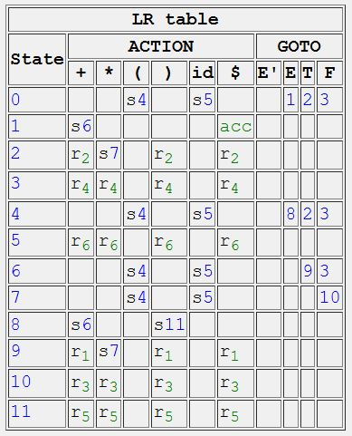

# SLR-parser

주어진 문법(`grammar.txt`)과 파싱 테이블(`lr_table.txt`)을 기반으로 SLR(1) 파서를 구현한 프로젝트입니다.<br>
입력된 토큰 시퀀스를 분석해서 파스트리를 생성하고, 에러 발생 시 위치와 원인을 출력합니다.
<br><br>

## 🎯 주요 기능

```
- SLR(1) 파싱 루프 (Shift / Reduce, Accept / Reject)
- 에러 리포트: 위치와 원인을 `^` 표시로 안내
- 파스트리 생성 및 ASCII 출력
- 실행 결과 파일 저장
```

<br><br>

## 📊 SLR Parsing Table

본 프로젝트에서 사용한 SLR(1) 파싱 테이블은 아래와 같습니다.
<br><br>

<br><br>

## 🚀 실행 방법

1. 입력 파일 작성 (ex: `inputs/01.txt`)
2. 실행
   ```
   python main.py inputs/01.txt
   ```
3. 출력
   (결과는 `outputs/01_tree.txt`에 저장됩니다.)

<br><br>

## 📁 폴더 구조

```
SLR-parser/
├─ inputs/
│  └─ 01.txt               # 예제 입력
├─ outputs/                # 결과 저장 폴더
├─ grammar.txt             # CFG 정의
├─ lr_table.txt            # SLR 파싱 테이블
├─ main.py                 # 엔트리포인트
├─ syntax_analyzer.py      # SLR 파서 본체
├─ table_generator.py      # LR Action/Goto/Grammar 파일 로더
└─ tree.py                 # 파스트리 Node 및 시각화
```

<br><br>
